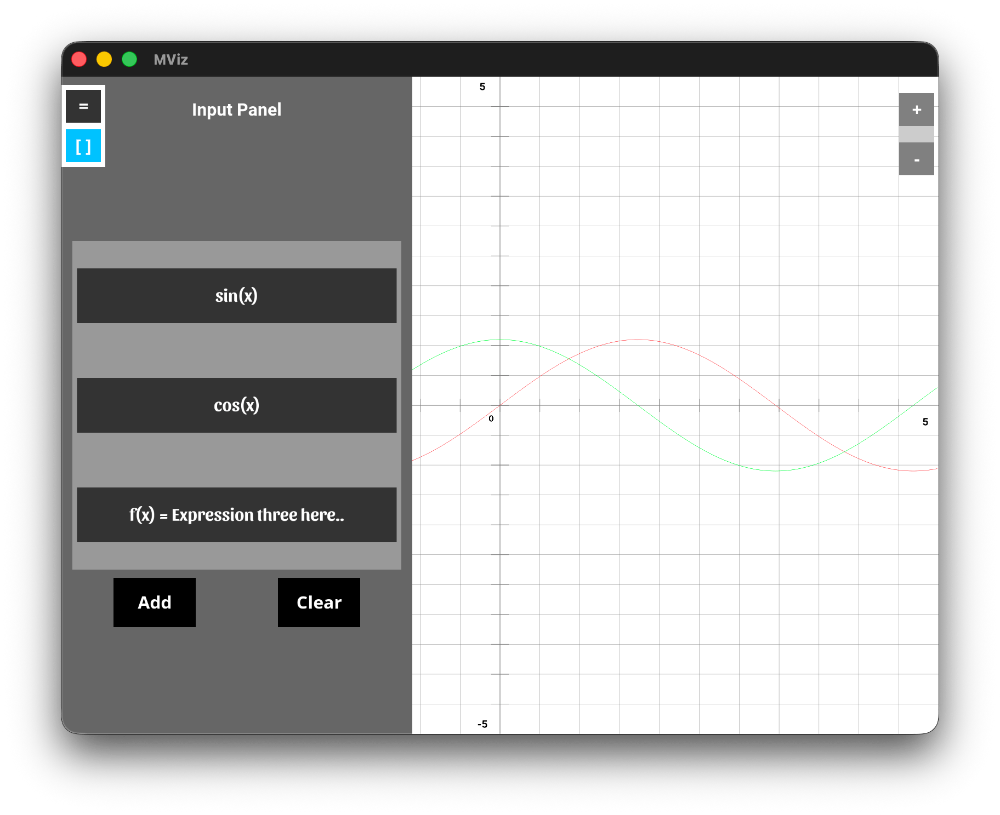
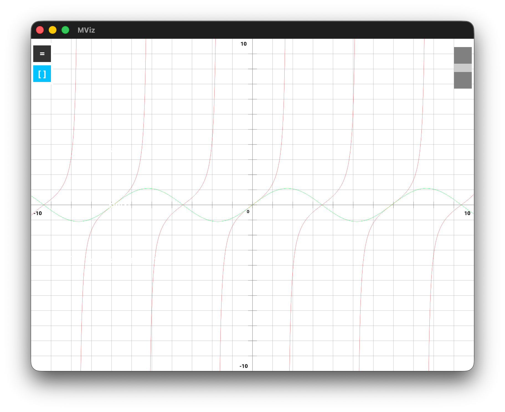
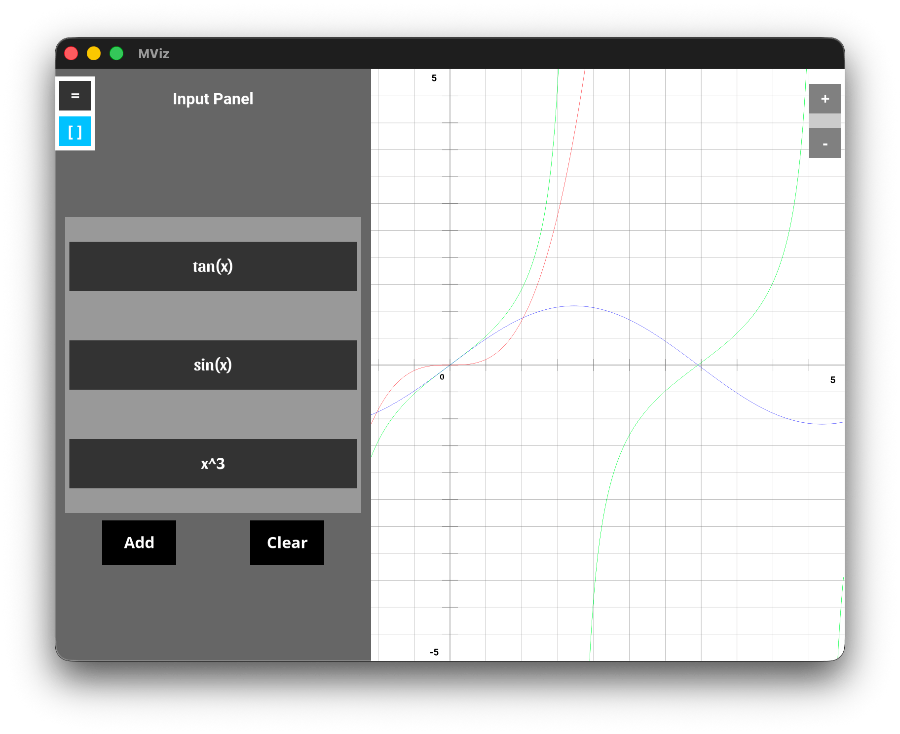

# MViz
MViz is the Mathematical Visualization program developed as the part of the College Project (OOPs/C++)

**Tools/Dependencies**
- OpenGL - version 3.3 core
- GLAD - function loaders
- GLFW - Windows, Cotext,.. managing
- GLM - Mathematics Library
- cppGenerator (optional) - python program to generate the new cpp file of given name as class name wrapped around MViz namespace with few boiler plate..

> [!Warning]
> Update: This is poorly implemented project, might update soon

<hr />

### How to use
1. Clone the repo
```bash
git clone -b <branch_name> https://github.com/Thaparoshan143/MViz
```

2. Goto builds folder, build (Makefile) & run exe.
```bash
cd ./builds # change to builds dir
make mviz # other make cmd available are: mviz_clean, clean, etc
./Exe/test # run the executable.. or text.exe for windows..
```

<hr />

### Some Showcase Highlights
- **Two Equation plot**


- **Fullscreen**


- **Three Equation plot**



### Refrences
- The Cherno ([Youtube](https://www.youtube.com/watch?v=W3gAzLwfIP0&list=PLlrATfBNZ98foTJPJ_Ev03o2oq3-GGOS2))
- learnopengl ([website](https://learnopengl.com/))
- documentation ([website](https://docs.gl/))

> [!warning]
> This project is developed in/for both windows (x64) and mac (apple silicon). For others, please find the appropriate lib & include files to attach to source.

> [!important]
> This project is no longer in development process. (if additional required, need to add to source)
<hr />

## MViz Naming Conventions

### For the Class:
- member variable :- m_camelCasing
- member function (accessible/public) :- PascalCasing
- member function (private/protected) :- camelCasing

### For Struct
- member variables :- camelCasing
- member function (accessible/public) :- PascalCasing
- member function (private/protected) :- camelCasing

### Helper Utility Functions
- function name :- _snake_casing

### main:
- global Variable : *
- local Vaiable : camelCasing
- helper functions : snake_casing


> [!Note]
> The build system and other can be made better & might be updated soon in future.. (**COMMING SOON**)
